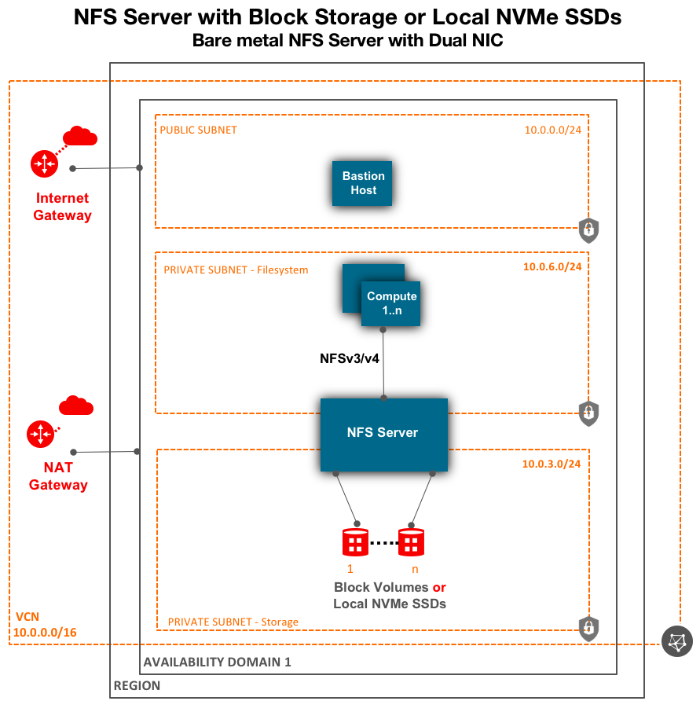

# oci-nfs
oci-nfs template is a solution to deploy NFS server in an active/passive High Availability (HA) cluster or a single node NFS server.  OCI's Shared (Multi-attach) Block Volume Storage are a perfect fit to be the storage backend for a highly available NFS cluster.  For HA, the solution utilizes open source corosync/pacemaker.   The solution also allows you to deploy a singe node NFS server,  using either local NVMe SSDs or network attached Block volumes.  Optionally,  with the template, you can deploy NFS client nodes too.   

OCI NFS solution supports both NFSv3 and NFSv4.   

Bare metal Standard (BM.Standard2.x ) compute nodes come with 2 physical NICs (2x25Gbps). To get best performance,  network bandwidth of both NICs can be used by creating 2 private subnets.  One subnet (private-storage) is used for data transfer between NFS server and OCI Block Volumes (disks) and second subnet (private-fs) is used for data transfer between NFS clients and NFS server.   


## Architecture
Given below are various high level architecture for NFS deployment. 

### Virtual Machines - Active/Passive NFS Server in a High Availability Cluster


    
### Bare metal Nodes - Active/Passive NFS Server in a High Availability Cluster
Bare metal nodes comes with 2 physical NICs (2x25Gbps). To get best performance,  network bandwidth of both NICs can be used by creating 2 private subnets.  One subnet (private-storage) is used for data transfer between NFS server and OCI Block Volumes (disks) and second subnet (private-fs) is used for data transfer between NFS clients and NFS server.   


### Virtual Machines - Single NFS Server with Block Volumes or Local NVMe SSDs


### Bare metal Nodes - Single NFS Server with Block Volumes or Local NVMe SSDs
Bare metal nodes comes with 2 physical NICs (2x25Gbps). To get best performance,  network bandwidth of both NICs can be used by creating 2 private subnets.  One subnet (private-storage) is used for data transfer between NFS server and OCI Block Volumes (disks) and second subnet (private-fs) is used for data transfer between NFS clients and NFS server.   




## Prerequisites
First off you'll need to do some pre deploy setup.  That's all detailed [here](https://github.com/oracle/oci-quickstart-prerequisites).

## Clone the Terraform template
Now, you'll want a local copy of this repo.  You can make that with the commands:

```
git clone https://github.com/oracle-quickstart/oci-nfs.git
cd oci-nfs/
ls
```

## Customize the template 
Create a terraform.tfvars file and set values as per your needs.  We recommend to use terraform.tfvars to override values in variables.tf file.   

```
cat terraform.tfvars
# Valid values for Availability Domain: 0,1,2, if the region has 3 ADs, else only 0.
ad_number=0
# Scratch or Persistent.  Persistent fs_type will use network attached Block volumes (redundant/more durable). Scratch fs_type will use local NVMe SSDs attached to the VM/BM DenseIO node.
fs_type="Persistent"
# Set to true to create 2 node NFS server with active/passive high availability cluster.  Can only be used with fs_type="Persistent".  If set to false, a single node NFS server will be deployed.
fs_ha="true"
client_node_shape="VM.Standard2.2"
# set, when fs_type="Persistent", otherwise, its value is ignored.
persistent_storage_server_shape="BM.Standard2.52"
# set/uncomment, when fs_type="Scratch", otherwise, its value is ignored.
# scratch_storage_server_shape="VM.DenseIO2.16"
# Storage disk (OCI Block Volumes) to attach for Persistent NFS filesystem.  Not applicable for "Scratch" filesystem, since it will use local NVMe SSDs attached to the VM/BM DenseIO node.
storage_tier_1_disk_count="8"
# Disk capacity in GB per disk
storage_tier_1_disk_size="800"
# Disk performance tiers - "Higher Performance",  "Balanced" & "Lower Cost"
storage_tier_1_disk_perf_tier="Higher Performance"
mount_point="/mnt/nfs"
```


## Deployment and Post Deployment
Deploy using standard Terraform commands

```
terraform init
terraform plan
terraform apply 
```


### Filesystem mounted on clients 

