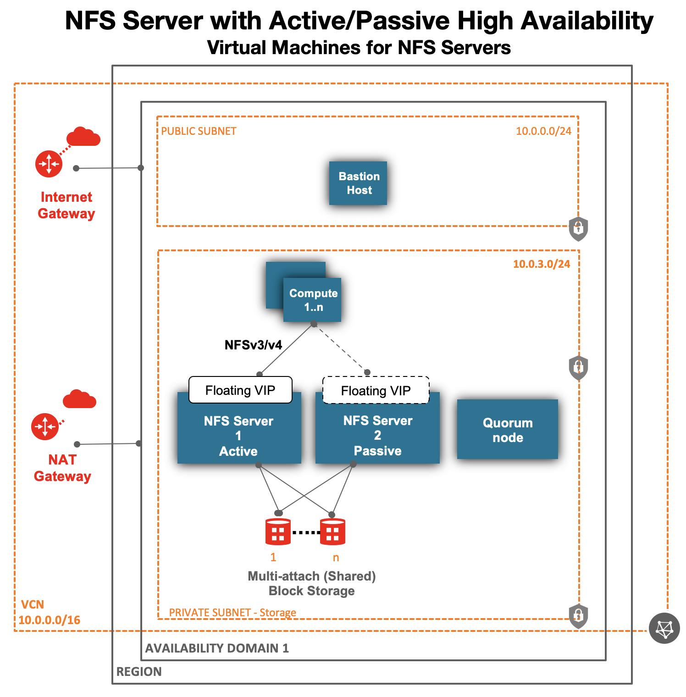
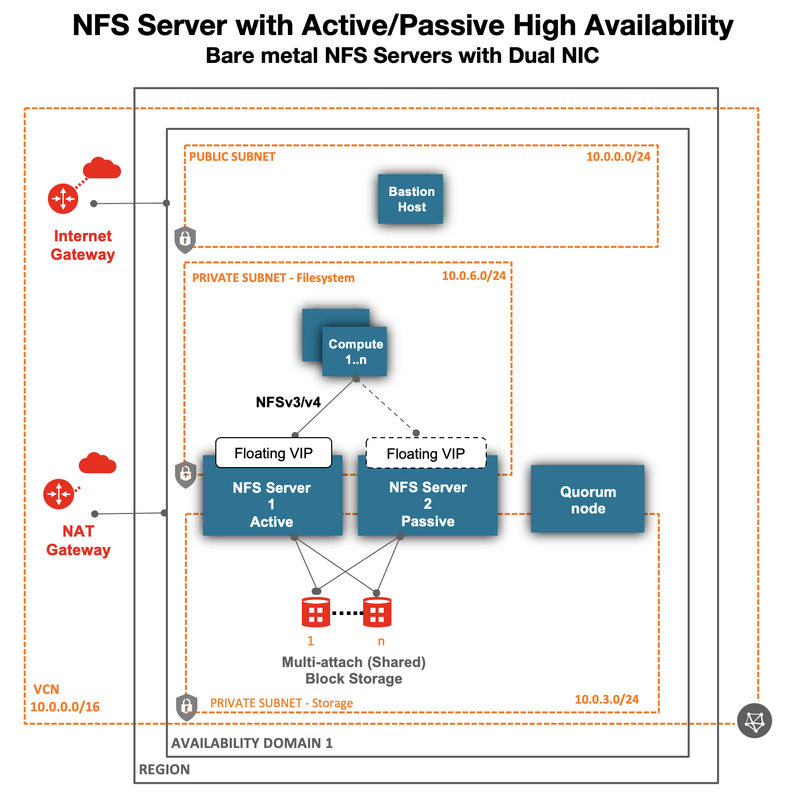
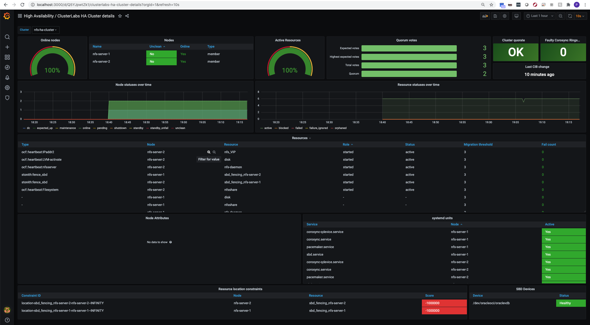

# oci-nfs
oci-nfs template is a solution to deploy NFS server in an active/passive High Availability (HA) cluster or a single node NFS server. For NFS with HA, the solution provisions two NFS servers and one Quorum node. For HA, the solution utilizes open source corosync/pacemaker cluster services along with corosync qdevice for quorum on Quorum node. OCI's Shared (Multi-attach) Block Volume Storage saves 50% in storage cost versus traditional DRBD (Distributed Replicated Block Device) replication across 2 servers for high availability. The solution also allows you to deploy a singe node NFS server,  using either local NVMe SSDs or network attached Block volumes.  Optionally,  with the template, you can deploy NFS client nodes too.   

OCI NFS solution supports both NFSv3 and NFSv4.   

 come with 2 physical NICs (2x25Gbps or 2x50Gbps). To get best performance,  network bandwidth of both NICs can be used by creating 2 private subnets.  One subnet (private-storage) is used for data transfer between NFS server and OCI Block Volumes (disks) and second subnet (private-fs) is used for data transfer between NFS clients and NFS server.   

HA Stonith Fencing:  We use SBD (Split Brain Detection) fencing agent to protect the cluster against split brain and data corruption. SBD fencing requires a shared disk (different from NFS data disks)  attached to both NFS server nodes.  The template provisions the fencing shared disk and configures it. 

Quorum Node:  Using just 2 nodes in production is not recommended, since it has limitations. A minimum of 3 nodes are required to maintain quorum, especially when one of the node fails or gets network isolated from other nodes.  We can use a VM with 1 or 2 OCPU.
 

| Resource Type | Mandatory |         Resource Count         | Resource Details  |  Comments |
| :---: | :---: | :---: | :--- | :--- | 
| NFS Servers: Compute | Yes |  2   | Bare Metal Compute shapes are recommended for best performance, since they come with 2 physical NICs.  BM.Standard2.52 &  BM.Standard.E2.64 have 2x25Gbps.  BM.Standard.E3.128/BM.Standard.E4.128 comes with 2x50Gbps. VMs are also supported.  | NFS HA cluster - min/max: 2.  Single node NFS - min/max: 1 |
| Quorum Node: Compute | Yes |  1  | Compute shape with 1 or 2 Core (OCPU). VM.Standard2.1/2.2/.E2.1/.E2.2  | Required only for HA solution, not for single node NFS server. | 
| Stonith SBD Fencing Disk: OCI Block Volumes (/dev/oracleoci/oraclevdb) | Yes |  1  | Shared Disk - Multi-attach Block Volume is attached to both NFS Server nodes.  | Required only for HA solution, not for single node NFS. |
| Data Volumes:  OCI Block Volumes | Yes |  Max: 31  | HA solution: Shared Disk/Multi-attach Data Block Volume are attached to both NFS Server nodes.  Create a Volume Group of all Data Volumes and an LVM using the Volume Group with Striping.  Maximum LVM capacity: 31x32TB = 992TB.  Each Data Volume Capacity: min: 50GB, Max: 32TB. Single node NFS server:  32x32TB=1PB. | NFS HA cluster - min:1 , max: 31.  Single node NFS - min:1 , max: 32 |
| Client Node: Compute | No |  min:0  | Recommend provisioning 1 client node to test mounting of the filesystem.  For production, select compute shape based on performance requirements.  | |
| Bastion Node: Compute | Yes |  1  | VM.Standard2.2 is the default shape for Bastion.  | |


## Architecture
Given below are various high level architecture for NFS deployment. 

### Virtual Machines - Active/Passive NFS Server in a High Availability Cluster


    
### Bare metal Nodes - Active/Passive NFS Server in a High Availability Cluster
Bare metal nodes comes with 2 physical NICs (2x25Gbps). To get best performance,  network bandwidth of both NICs can be used by creating 2 private subnets.  One subnet (private-storage) is used for data transfer between NFS server and OCI Block Volumes (disks) and second subnet (private-fs) is used for data transfer between NFS clients and NFS server.   



### Virtual Machines - Single NFS Server with Block Volumes or Local NVMe SSDs


### Bare metal Nodes - Single NFS Server with Block Volumes or Local NVMe SSDs
Bare metal nodes comes with 2 physical NICs (2x25Gbps). To get best performance,  network bandwidth of both NICs can be used by creating 2 private subnets.  One subnet (private-storage) is used for data transfer between NFS server and OCI Block Volumes (disks) and second subnet (private-fs) is used for data transfer between NFS clients and NFS server.   


## Prerequisites

### 1. OCI Dynamic Group and Policies for active/passive high availability NFS cluster
The below two requirements are only applicable if you plan to deploy an active/passive high availability NFS cluster.  You must authorize instances to call services in Oracle Cloud Infrastructure.


     1. Create a dynamic group of compute instances in your compartment (OCI console > Identity > Dynamic Groups).  For more documentation, refer to https://docs.cloud.oracle.com/en-us/iaas/Content/Identity/Tasks/callingservicesfrominstances.htm.  Once instances are provisioned,  the dynamic group can be further restricted to only include the instance_id of the 2 NFS servers. 

 ```
               ANY {instance.compartment.id =  'compartment.ocid'}
 ```

     2. Create policies to authorize dynamic group to use vnics, subnets and private-ips APIs.

```
             Allow dynamic-group nfs_high_availability to use private-ips in compartment <your compartment>

             Allow dynamic-group nfs_high_availability to use vnics in compartment <your compartment>

	         Allow dynamic-group nfs_high_availability to use subnets in compartment <your compartment>

```

### 2. Existing VCN/Subnets
If you plan to deploy in an **existing VCN & subnets**, then allow TCP & UDP traffic for the 2 private subnets (in case of Baremetal NFS server or in one private subnet (in case of NFS server using VMs). Add below rules to allow all TCP and UDP traffic within VCN CIDR range or for the 2 private subnets. 

```
        Ingress Rule: Stateless: No, Source: VCN_CIDR ,  IP Protocol: TCP ,  Leave other fields empty/default.  
        Ingress Rule: Stateless: No, Source: VCN_CIDR ,  IP Protocol: UDP ,  Leave other fields empty/default.  
        Egress Rule: Stateless: No, Destination: 0.0.0.0/0 ,  IP Protocol: All Protocols  ,  Leave other fields empty/default.  
```


## Resource Manager Deployment
This Quick Start uses [OCI Resource Manager](https://docs.cloud.oracle.com/iaas/Content/ResourceManager/Concepts/resourcemanager.htm) to make deployment easy, sign up for an [OCI account](https://cloud.oracle.com/en_US/tryit) if you don't have one, and just click the button below:

[](https://console.us-ashburn-1.oraclecloud.com/resourcemanager/stacks/create?region=home&zipUrl=https://github.com/oracle-quickstart/oci-nfs/blob/master/orm/dist/nfs.zip)


## Marketplace Deployment 
If you prefer to use a GUI console to deploy, you can use the Markeplace listing to deploy: [NFS Server in an active/passive high availability cluster](https://cloudmarketplace.oracle.com/marketplace/en_US/listing/82147253)

## Terraform Deployment
If you prefer Terraform, then follow the below steps.  

1. First off you'll need to do some pre deploy setup.  That's all detailed [here](https://github.com/oracle/oci-quickstart-prerequisites).

2. Now, you'll want a local copy of this repo.  You can make that with the commands:

```
git clone https://github.com/oracle-quickstart/oci-nfs.git
cd oci-nfs/
ls
```

### Customize the template 
Create a terraform.tfvars file and set values as per your needs.  We recommend to use terraform.tfvars to override values in variables.tf file.   

```
cat terraform.tfvars
# Valid values for Availability Domain: 0,1,2, if the region has 3 ADs, else only 0.
ad_number=0
# Scratch or Persistent.  Persistent fs_type will use network attached Block volumes (redundant/more durable). Scratch fs_type will use local NVMe SSDs attached to the VM/BM DenseIO node.
fs_type="Persistent"
# Set to true to create 2 node NFS server with active/passive high availability cluster.  Can only be used with fs_type="Persistent".  If set to false, a single node NFS server will be deployed.
fs_ha="true"
# set, when fs_type="Persistent", otherwise, its value is ignored.
persistent_storage_server_shape="BM.Standard2.52"
# set/uncomment, when fs_type="Scratch", otherwise, its value is ignored.
# scratch_storage_server_shape="VM.DenseIO2.16"
# Storage disk (OCI Block Volumes) to attach for Persistent NFS filesystem.  Not applicable for "Scratch" filesystem, since it will use local NVMe SSDs attached to the VM/BM DenseIO node.
storage_tier_1_disk_count="8"
# Disk capacity in GB per disk
storage_tier_1_disk_size="800"
# Disk performance tiers - "Higher Performance",  "Balanced" & "Lower Cost"
storage_tier_1_disk_perf_tier="Higher Performance"
create_compute_nodes=true
client_node_shape="VM.Standard.E2.2"
client_node_count=1
mount_point="/mnt/nfs"

create_monitoring_server=false
monitoring_server_shape="VM.Standard2.1"


```


### Deployment and Post Deployment
Deploy using standard Terraform commands

```
terraform init
terraform plan
terraform apply 
```


### Filesystem mounted on clients 


## Grafana Dashboard for HA Cluster Resources (Corosync/Pacemaker)
Optionally, this template can deploy a Grafana monitoring server and metrics collectors on all NFS-HA nodes to monitor HA Cluster resources.  It uses a dashboard from ClusterLabs.org.  




